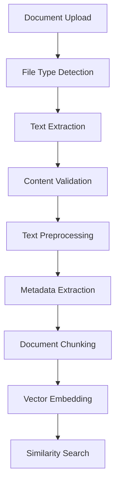

### It is advised to use virtual environment

### Installation

1. Clone the repository:
```bash
git clone <repository-url>
cd IntelliContextAI
```

2. Create a `.env` file and add your Groq API key:
```
GROQ_API_KEY=your_groq_api_key_here
```

3. Install all required packages:
```bash
pip install -r requirements.txt
```

### Running the Application

Launch the application using Streamlit:
```bash
streamlit run main.py
```

The application will be available at `http://localhost:5000`

## 🎯 Usage Guide

### 1. Document Upload
- Click the "Upload Documents" section in the sidebar
- Supported formats: PDF, DOCX, TXT
- The system will automatically process and analyze the document
- View document statistics including word count and estimated reading time

### 2. Chat Interface
- Enter your questions in the chat input
- The assistant will:
  1. Search for relevant context in your documents
  2. Display the matching content (expandable)
  3. Generate a comprehensive response
  4. Stream the response in real-time

### 3. Context Visualization
- Click the "📚 Relevant Context" expander to view source material
- The system automatically selects the most relevant document sections
- Context is preserved across conversation turns

## 🏗️ Technical Architecture

### Document Processing Pipeline



### Key Components

1. **DocumentPreprocessor**
   - Text cleaning and normalization
   - Content validation
   - Metadata extraction
   - Character encoding handling

2. **DocumentProcessor**
   - Multi-format file handling
   - Chunking strategy
   - Progress tracking
   - Error handling

3. **MinHashEncoder**
   - Efficient document vectorization
   - Semantic similarity computation
   - Optimized search capabilities

4. **ChatManager**
   - Groq API integration
   - Response streaming
   - Context management
   - Conversation flow

## 🛠️ Configuration

### Streamlit Configuration (.streamlit/config.toml)
```toml
[server]
port = 5000
