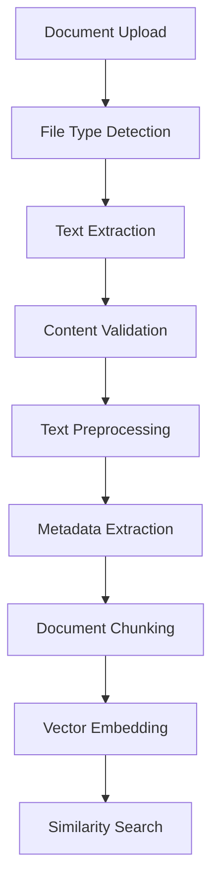

# IntelliContextAI - RAG-Powered AI Assistant

## 📌 Overview
**IntelliContextAI** is an AI-powered document analysis and chat system utilizing **Retrieval-Augmented Generation (RAG)**. It allows users to upload documents (PDF, DOCX, TXT) and interact with an AI assistant capable of answering questions based on the uploaded content. The system integrates **Groq AI** for intelligent response generation, ensuring contextual accuracy.

## 🚀 Features
- **📝 Document Upload:** Supports PDF, DOCX, and TXT file formats.
- **🗣️ Intelligent Chat Interface:** AI assistant fetches relevant context from uploaded documents before responding.
- **📚 Context-Aware Responses:** Displays relevant document excerpts along with AI-generated answers.
- **⚡ Fast & Scalable:** Utilizes **vector embeddings** for efficient similarity search.
- **🎨 Streamlit UI:** Interactive and user-friendly interface.
- **🌐 Dynamic LLM Selection:** Allows users to choose from multiple LLMs via a dropdown menu.

---

## 🛠️ Installation Guide

### 1️⃣ Clone the Repository
```bash
git clone https://github.com/shreyasm007/IntelliContextAI.git
cd IntelliContextAI
```

### 2️⃣ Set Up Environment Variables
Create a `.env` file in the project root or use the env.example and add your **Groq API key**:
```ini
GROQ_API_KEY=your_groq_api_key_here
```

### 3️⃣ Install Dependencies
```bash
pip install -r requirements.txt
```

---

## ▶️ Running the Application
Launch the application using **Streamlit**:
```bash
streamlit run main.py
```
By default, the app will be accessible at **http://localhost:8501**.

---

## 🎯 Usage Guide

### 📂 1. Document Upload
- Navigate to the **"Upload Documents"** section in the sidebar.
- Upload PDF, DOCX, or TXT files.
- The system processes the document and extracts key information.
- Displays **word count** and **estimated reading time**.

### 💬 2. Chat Interface
- Type a question in the chat box.
- The assistant:
  1. Searches for relevant content in uploaded documents.
  2. Displays matching excerpts.
  3. Generates and streams AI-powered responses.
- Select from multiple **LLM models** using a dropdown menu in the UI.

### 🔍 3. Context Visualization
- Expand **"📚 Relevant Context"** to view referenced content.
- AI ensures contextual consistency across conversation turns.

---

## 🏡 Technical Architecture

### 💜 Document Processing Pipeline


### 🔑 Key Components

#### **1. DocumentPreprocessor**
- Text normalization & cleaning
- Content validation
- Metadata extraction
- Encoding handling

#### **2. DocumentProcessor**
- Multi-format file handling
- Document chunking
- Efficient progress tracking

#### **3. MinHashEncoder**
- Vectorizes documents for similarity search
- Computes semantic relevance

#### **4. ChatManager**
- Handles Groq API integration
- Streams AI-generated responses
- Manages chat session state
- Supports dynamic LLM selection

---

## ⚙️ Configuration

### Streamlit Configuration (`.streamlit/config.toml`)
```toml
[server]
port = 8501
```

### Environment Variables (`.env`)
```ini
GROQ_API_KEY=your_groq_api_key_here
```

---

## 🏁 Future Enhancements
- 🍿️ **Multilingual Support** for wider accessibility.
- 📊 **Enhanced Document Analytics** for deeper insights.
- 🤖 **Customizable AI Models** for specific industry applications.
- 🔍 **Advanced Search Features** with keyword filtering.

---

## 🤝 Contributing
Feel free to contribute to this project by opening issues or submitting pull requests.

### Steps to Contribute:
1. **Fork** this repository.
2. Create a **new branch** for your feature.
3. Commit your changes and **push** to your fork.
4. Open a **Pull Request (PR)**.

---

## 👨‍💻 Author
**Shreyas Mohite**  
🚀 Generative AI Engineer | Full Stack Developer

For queries or collaborations, feel free to reach out! 🚀

